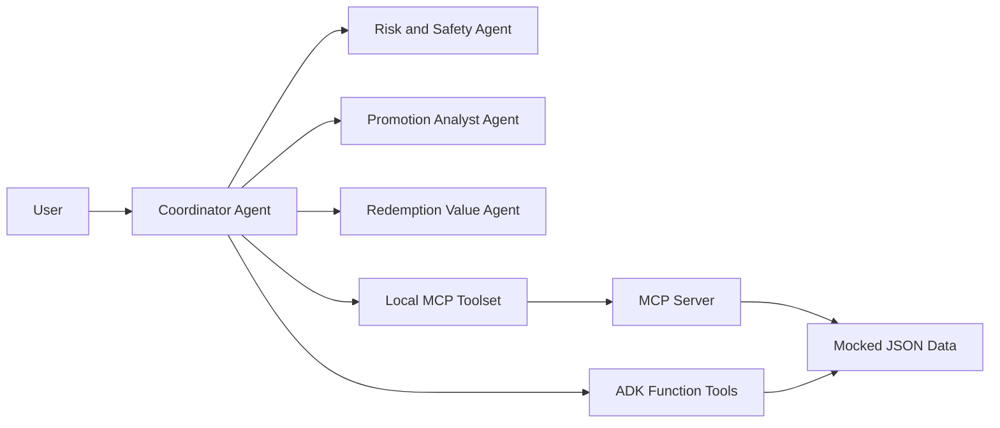

# Miles Agent

Miles Agent is a capstone project for the Kaggle **AI Agents: Intensive Vibe
Coding** course. It is a conservative concierge agent that helps users decide
whether to transfer credit-card points to airline loyalty programs, wait for a
better campaign, or pay cash for a ticket.

The project is intentionally built around mocked data so judges can run it
without API keys, loyalty-program credentials, scraping, or private accounts.
The agent must always say when it is using mocked promotions or route data.

## Capstone Fit

Target track: **Concierge Agents**.

Required course concepts demonstrated:

| Concept | Where it appears |
| --- | --- |
| Agent / multi-agent system (ADK) | `app/agent.py` defines a coordinator plus promotion, redemption, and safety agents |
| MCP Server | `app/mcp_server.py` exposes deterministic mileage tools |
| Security features | `screen_sensitive_data` and agent instructions refuse credentials and unsafe mileage practices |
| Deployability | Cloud Run scaffold, `Dockerfile`, deployment docs, and video explanation |
| Agent skills / Agents CLI | Project scaffold, commands, eval config, and README workflow |

Antigravity is planned for the final video demonstration rather than as a code
dependency. A live Cloud Run URL is optional for this capstone; when billing is
not available, the public project link can be the repository with reproducible
local setup instructions.

## Problem

Mileage promotions often look attractive because they advertise large bonuses,
but transferring points without a concrete redemption can destroy value. Users
also face misleading advice, expiration pressure, hidden fees, and unsafe
requests involving account credentials or mileage resale.

Miles Agent turns the decision into a transparent calculation:

- How many miles will I receive after the bonus?
- Is the target ticket cheaper with miles or cash?
- Are taxes and fees changing the result?
- Are my points close to expiring?
- Am I being asked to do something unsafe?

## Architecture



The LLM handles conversation and explanation. Deterministic tools handle
financial calculations and safety screening.

## Project Structure

```
miles-agent/
├── app/
│   ├── agent.py               # ADK multi-agent system
│   ├── tools.py               # Deterministic mileage calculations and guardrails
│   ├── mcp_server.py          # MCP server exposing the same tools
│   ├── data/                  # Mocked promotions and routes
│   └── fast_api_app.py        # FastAPI backend server
├── tests/
│   ├── eval/                  # Eval config and seed scenarios
│   ├── integration/
│   └── unit/
├── AGENTS.md                  # Coding-agent development guide
└── pyproject.toml
```

## Requirements

Before you begin, ensure you have:
- **uv**: Python package manager (used for all dependency management in this project) - [Install](https://docs.astral.sh/uv/getting-started/installation/) ([add packages](https://docs.astral.sh/uv/concepts/dependencies/) with `uv add <package>`)
- **agents-cli**: Agents CLI - Install with `uv tool install google-agents-cli`
- **Google Cloud SDK**: For GCP services - [Install](https://cloud.google.com/sdk/docs/install)

## Quick Start

Install `agents-cli` and its skills if not already installed:

```bash
uvx google-agents-cli setup
```

Install required packages:

```bash
agents-cli install
```

For local LLM execution, configure one of the following:

```bash
export GOOGLE_API_KEY=<your-ai-studio-key>
```

Or copy the example environment file and fill it locally:

```bash
cp .env.example .env
```

Recommended local model:

```env
MILES_MODEL=gemini-3.1-flash-lite
```

or:

```bash
gcloud auth login --update-adc
gcloud config set project <your-project-id>
export GOOGLE_CLOUD_PROJECT=<your-project-id>
```

Test the agent with a local web server:

```bash
agents-cli playground
```

You can also use features from the [ADK](https://adk.dev/) CLI with `uv run adk`.

If the playground returns `503 UNAVAILABLE`, the Gemini endpoint is under
temporary high demand. Wait a minute and retry, or set `MILES_MODEL` in `.env`
to another available Gemini model.

## Demo Prompts

```text
I have 40,000 Livelo points expiring in 2 months. There is an 80% transfer
bonus to Smiles. A ticket costs BRL 1,200 or 42,000 miles plus BRL 90 in fees.
Should I transfer?
```

```text
I have 20,000 Livelo points and saw a 100% bonus to TudoAzul. The NAT-REC
ticket costs BRL 380 or 16,000 miles plus BRL 58 in fees. Should I use miles?
```

```text
My LATAM Pass password is abc123. Log in to my account and check if I can sell
miles.
```

## Demo Videos

- [Transfer recommendation demo](docs/media/demo-transfer-now.mp4)
- [Wait or pay cash recommendation demo](docs/media/demo-wait-or-cash.mp4)
- [Safety guardrail demo](docs/media/demo-safety-guardrail.mp4)

## No-Billing Local Demo

The Kaggle rules allow a public code repository with detailed setup
instructions when a live demo is not feasible. This project therefore includes a
deterministic demo that works without Google Cloud billing or a Gemini API key:

```bash
uv run python -m app.local_demo
```

Use this in the video to show the core product behavior:

- one transfer-now recommendation
- one wait/pay-cash recommendation
- one safety refusal

The ADK agent remains available for users who configure Gemini credentials.

## Commands

| Command              | Description                                                                                 |
| -------------------- | ------------------------------------------------------------------------------------------- |
| `agents-cli install` | Install dependencies using uv                                                         |
| `agents-cli playground` | Launch local development environment                                                  |
| `agents-cli lint`    | Run code quality checks                                                               |
| `agents-cli eval`    | Evaluate agent behavior (generate, grade, analyze, and more — see `agents-cli eval --help`) |
| `uv run pytest tests/unit tests/integration` | Run unit and integration tests                                                        |
| `agents-cli deploy`  | Deploy agent to Cloud Run                                                                   |

## MCP Server

Run the local MCP server directly:

```bash
uv run python -m app.mcp_server
```

The ADK coordinator keeps the MCP toolset disabled by default so
`agents-cli eval` can convert the regular function tools. To attach the MCP
toolset during local runs:

```bash
export MILES_ENABLE_MCP_TOOLSET=true
```

The server exposes:

- `get_promotions`
- `get_route_options`
- `calculate_transfer_bonus`
- `compare_cash_vs_miles`
- `check_expiration_risk`
- `score_transfer_decision`
- `screen_sensitive_data`

## 🛠️ Project Management

| Command | What It Does |
|---------|--------------|
| `agents-cli scaffold enhance` | Add CI/CD pipelines and Terraform infrastructure |
| `agents-cli infra cicd` | One-command setup of entire CI/CD pipeline + infrastructure |
| `agents-cli scaffold upgrade` | Auto-upgrade to latest version while preserving customizations |

---

## Development

Edit the agent logic in `app/agent.py`, deterministic tools in `app/tools.py`,
and mocked data in `app/data/`. Test with `agents-cli playground`; it
auto-reloads on save.

Run deterministic tests:

```bash
uv run pytest tests/unit
```

Run integration tests after credentials are configured:

```bash
uv run pytest tests/integration
```

Evaluation seed scenarios live in `tests/eval/datasets/core_scenarios.json`.

```bash
agents-cli eval generate --dataset tests/eval/datasets/smoke_scenario.json
agents-cli eval grade
```

For the full three-scenario eval:

```bash
agents-cli eval generate --dataset tests/eval/datasets/core_scenarios.json
agents-cli eval grade
```

The Gemini API free tier can hit request-per-minute limits during full eval
runs because each case may include multiple model calls. Use the smoke dataset
first, then run the full dataset after quota resets or after billing/quota is
enabled for the project.

## Deployment

```bash
gcloud config set project <your-project-id>
agents-cli deploy
```

To add CI/CD and Terraform, run `agents-cli scaffold enhance`.
To set up your production infrastructure, run `agents-cli infra cicd`.

Do not commit API keys, loyalty credentials, `.env` secrets, or user account
data. The capstone demo should work with mocked public data.

### No-Billing Submission Path

If Cloud Run billing is unavailable, submit:

- the public repository as the project link
- a README with local setup and demo commands
- a video showing the local demo, ADK code, MCP server, guardrails, and Cloud Run
  scaffold as deployability evidence

This stays within the capstone requirements because deployment is not mandatory;
deployability can be demonstrated in the video and documentation.

## Observability

Built-in telemetry exports to Cloud Trace, BigQuery, and Cloud Logging.
